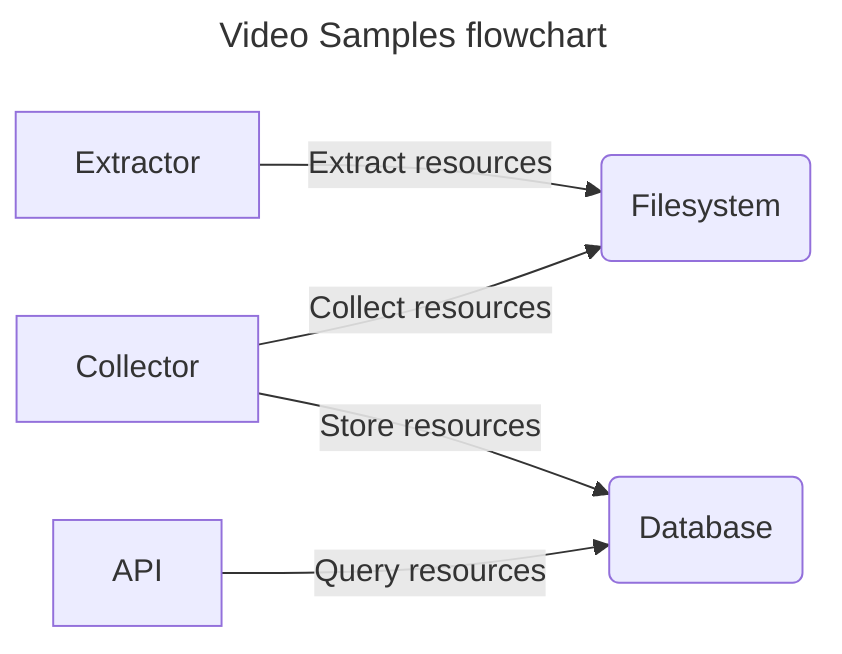

# Design

This document describes the rationale behind the Video Samples project.

## What it is?

Video Samples is a software used to extract resources from video.

## How does it work?

As technology users, we are not comfortable with the idea of installing multiple frameworks, libs and tools to perform a single task. We like to use the same set of primitives to make something usable. This is the idea behind Video Samples: it is a software that can **extract** video resources, **store** them somewhere and **retrieve** them using a nice API.

Let's jump right into the design of these components.

### Extractor

An extractor is responsible for generating assets from video and save it in the filesystem. Since we are using ffmpeg, we are restricted to some limitations like the assets that are written to the disk, forcing the program to create a mechanism to know when a new file has been created.

Extracting resources from video can be done in a multiple ways when using a programming language, but for this project we choose to rely on OS processes. We can build a ffmpeg command line, run it in background and maintain a list of video titles being processed. Extracting thumbnais from live video, for example, is a long running process - we need to apply some kind of healthcheck mechanism to ensure the resources are being extracted.
