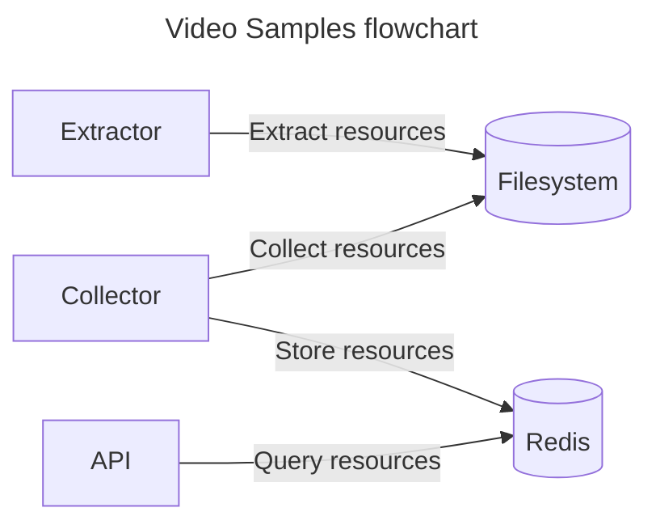
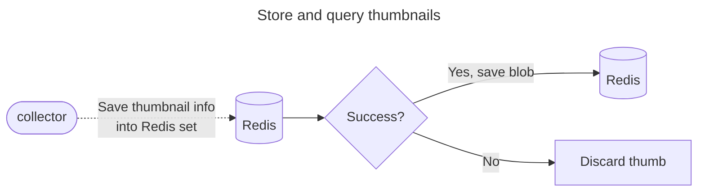

# Design

This document describes the rationale behind the Video Samples project.



## What it is?

Video Samples is a software used to extract resources from video.

## How does it work?

As technology users, we are not comfortable with the idea of installing multiple frameworks, libs and tools to perform a single task. We like to use the same set of primitives to make something usable. This is the idea behind Video Samples: it is a software that can **extract** video resources, **store** them somewhere and **retrieve** them using a nice API.

Let's jump right into the design of these components.

### Extractor

An extractor is responsible for generating assets from video and save it in the filesystem. Since we are using ffmpeg, we are restricted to some limitations like the assets that are written to the disk, forcing the program to create a mechanism to know when a new file has been created.

Extracting resources from video can be done in a multiple ways when using a programming language, but for this project we choose to rely on OS processes. We can build a ffmpeg command line, run it in background and maintain a list of video titles being processed. Extracting thumbnails from live video, for example, is a long running process - we need to apply some kind of healthcheck mechanism to ensure the resources are being extracted.

We don't want multiples ffmpeg processes running for the same feature and video. To avoid this behavior, we generate a unique ID composed by the video name and the feature.

### Collector

A collector is responsible for collecting the files generated from ffmpeg. When writing the file to disk,
ffmpeg writes the content to the file and then closes it. For event monitors like _inotify_, it is the `CLOSE_WRITE` event.

A monitor can be started to watch events of a given path and stores it everytime a new file shows up.

*Thumbnails* for live videos don't need to be kept forever in a database because live videos have the DVR (digital video recording) concept. DVR allows user to rewind the broadcast, going back in time.

The diagram below describes how we can store and query thumbnails:



To save a thumbnail, we can add them to a [sorted set](https://redis.io/commands/zadd/) and set the score with the timestamp value of the moment the thumbnail was inserted.

After collecting the thumbnail we can insert a member in Redis using unique identifier - we can use the very same identifier to upload the file in the storage.

Since we are dealing with sorted sets, we can use `ZADD`. Suppose we have a live streaming named _bunny_:

```
ZADD thumbnails/bunny 1677779184 5fdbadc9-b300-4514-9171-0297caba44bb
```

A routine can be fired to remove keys older than the thumbnail TTL (score), using [this Redis operation](https://redis.io/commands/zremrangebyscore/)